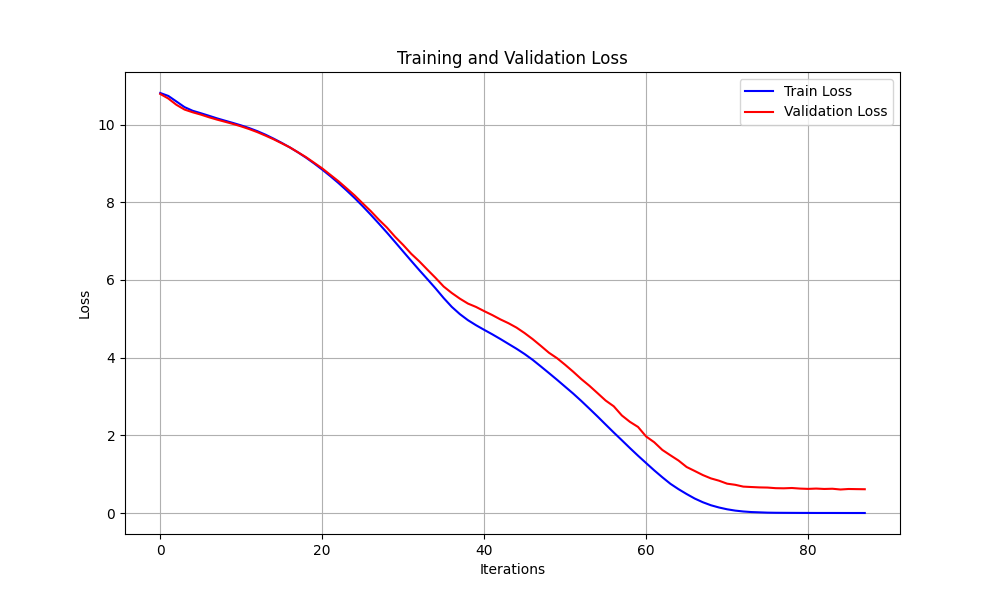

# YingGem-T1

🚀 **YingGem** is a lightweight Transformer-based language model designed for efficient text generation. It incorporates **sliding window attention** and **rotary positional embeddings** to maintain generation quality while significantly reducing computational complexity. Ideal for poetry generation, dialogue systems, and other NLP tasks.



## Key Features

### 🧠 Core Architecture
- **Sliding Window Attention** (`attention_window=512`): Limits each token's attention to local context, reducing memory usage.
- **RoPE (Rotary Position Embeddings)**: Dynamic positional encoding with θ=10000 for enhanced long-sequence modeling.
- **RMSNorm**: Replaces LayerNorm, improving computational efficiency by ~10-15%.
- **GeGLU Activation**: Gated mechanism enhances feed-forward network expressiveness.

### ⚙️ Training Optimizations
- **Adafactor Optimizer**: Memory-efficient optimizer recommended for large models.
- **Mixed Precision Training**: Accelerates training with bfloat16 and reduces GPU memory consumption.
- **Dynamic Early Stopping**: Halts training if validation loss plateaus for 3 consecutive epochs.
- **Gradient Clipping** (`max_grad_norm=1.0`): Stabilizes training.

### 🎯 Generation Strategies
- **Sampling Controls**: Supports temperature (0.1-1.0), top-k, and top-p sampling.
- **Repetition Penalty** (`repetition_penalty=1.2`): Reduces repetitive outputs.
- **KV Cache Window**: Maintains fixed-length context memory.

## Requirements

- Python 3.8+
- CUDA 11.7+
- Dependencies:
  ```bash
  pip install torch tiktoken transformers matplotlib tqdm
  ```

## Quick Start

### Training
```bash
python model.py --train
```
- Data: Place `shakespeare.txt` in the project directory.
- Default Config:
  - Batch Size: 8
  - Context Window: 1024 tokens
  - Hidden Size: 768
  - 12 Transformer Layers
  - Requires ~24GB GPU memory (RTX 4090D).

### Text Generation
```bash
python model.py --generate
```
Example Generation Parameters:
```python
generate(
    max_length=200,
    temperature=0.9, 
    top_p=0.85,
    repetition_penalty=1.2
)
```

## Architecture
```
YingGem
├── Embedding (50257 × 768)
├── 12× Transformer Blocks
│   ├── RMSNorm
│   ├── Sliding-Window Attention (12 heads)
│   └── GeGLU FFN (768 → 1024 → 768)
└── LM Head (768 × 50257)
```
Parameters: ~**133.96M**  
Training Speed: ~11.41s/epoch (RTX 4090D)

## Performance Optimizations
- **KV Cache Compression**: Retains only the latest 512 positional key-value pairs.
- **Flash Attention**: Interface reserved (disabled by default).
- **Memory Efficiency**: Reduces GPU memory usage by ~40% compared to standard Transformers.

## Configuration
```python
class YingGemConfig:
    # Tunable Parameters
    hidden_size = 768         # Model dimension
    num_hidden_layers = 12    # Number of layers
    attention_window = 512    # Attention window size
    rope_theta = 10000.0      # RoPE base frequency
    rms_norm_eps = 1e-6       # Normalization epsilon
```

## Contributing
We welcome contributions via Issues or PRs:
1. Integrate Flash Attention.
2. Add distributed training support.
3. Implement quantization for inference.

---

*Licensed under MIT. Architecture design inspired by LLaMA and GPT papers.*
```
